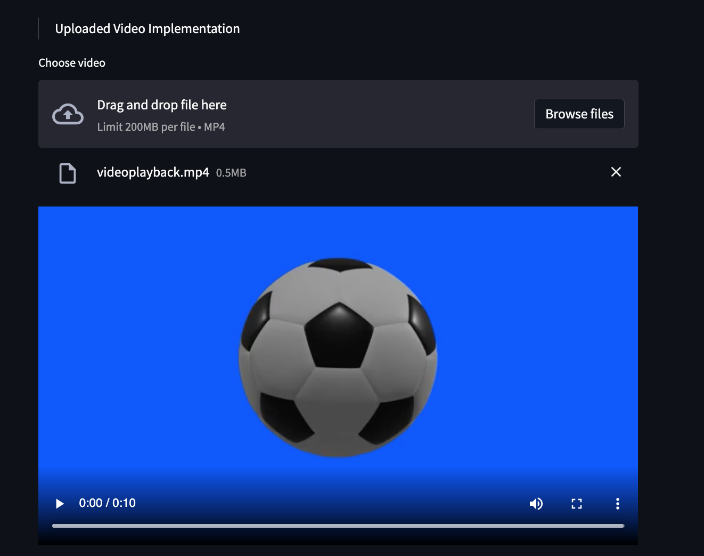

# Visualize Optical Flow 

This project makes use of [OpenCV](https://opencv.org/) and [Streamlit](https://streamlit.io/) to Visualize Optical Flow from Webcam Input and Uploaded Video.

## Optical Flow From Webcam Input

Takes real time input from webcam and generates stream of Optical Flow. 

- Select "Flow Field+Image" to overlay optical flow on top of the video input
- Select "Only Flow Field" to see only the flow field
- Select "Both" to see them both

[Checkout how it works !](https://youtu.be/sk2q45UMneg)

## Optical Flow From Uploaded Video

Upload a video by selecting a file or by dragging and dropping.

Meta Data like Number of Frames, Video Duration, FPS will be shown.

[Check Out how it works](https://youtu.be/k4KqhUSRSuY)